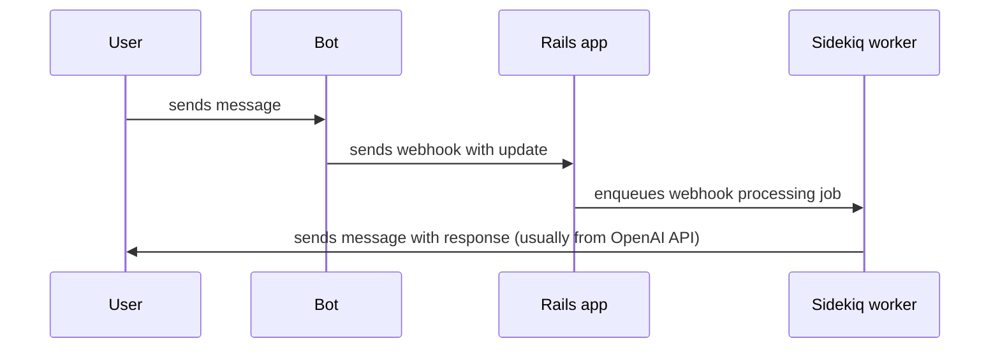

# 🤖 Hey GPT

Rails app that powers [Hey GPT](https://t.me/h3y_gpt_bot) Telegram bot.

Basically it's just a webhook handler which processes each message in the background using Sidekiq. Something like this:

## Stack

- Ruby/Rails/Sidekiq
- PostgreSQL
- Redis
